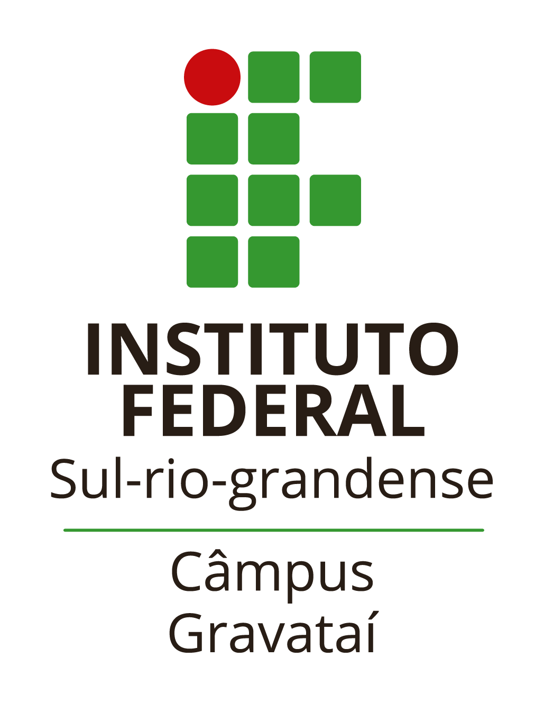
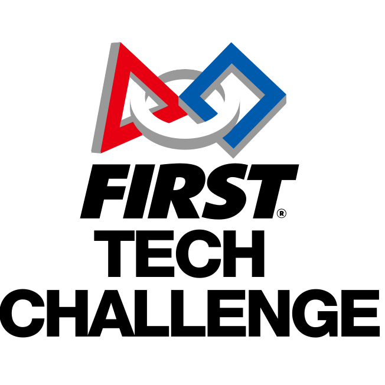
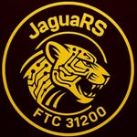
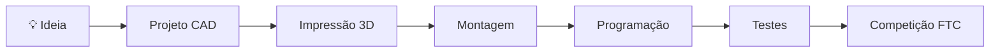

<div align="center">

<!-- ==================== BANNER ==================== -->


<br>


&nbsp;&nbsp;&nbsp;&nbsp;

&nbsp;&nbsp;&nbsp;&nbsp;


<br><br>


<br><br>


</div>

---

<div align="center">

#  FUTURE DRIVEN ROBOTICS


</div>

---

# 🐆 Sobre a Equipe

<div align="center">

A **JaguaRS FTC 31200** é a equipe de robótica competitiva do

**Instituto Federal Sul-rio-grandense – Campus Gravataí**

que representa o Rio Grande do Sul e Gravataí na
**FIRST Tech Challenge (FTC)**.

Nossa missão é desenvolver tecnologia, inovação e liderança
através da engenharia aplicada, programação avançada
e projetos de impacto social.

</div>

---

#  Dashboard da Equipe

<div align="center">

| 🐆 Equipe |  Categoria | Instituição |
|-----------|-------------|---------------|
| JaguaRS | FTC | IFSul Campus Gravataí |

|  País |  Estado |  Número |
|----------|----------|----------|
| Brasil | Rio Grande do Sul | 31200 |

</div>

---

#  Tecnologias

<div align="center">


</div>

<br>

<div align="center">

| Tecnologia | Aplicação |
|------------|------------|
|  Java | Programação do robô |
|  FTC SDK | Controle do robô |
|  EasyOpenCV | Visão Computacional |
|  Road Runner | Navegação Autônoma |
|  CAD | Projeto Mecânico |
|  Impressão 3D | Prototipagem |
|  GitHub | Controle de Versão |

</div>

---

#  Áreas da Equipe

<div align="center">

```text
       🐆 JAGUARS FTC
              │
 ┌────────────┼────────────┐
 │            │            │
                  
Software   Hardware   Marketing

 │            │            │

Java      CAD       Outreach
FTC SDK   Eletrônica Redes Sociais
OpenCV    Impressão3D Eventos
````

</div>

---

# Objetivos da Temporada

<div align="center">

🟠 Construir um robô competitivo

🟠 Aprimorar sistemas autônomos

🟠 Expandir ações de outreach

🟠 Promover robótica educacional

🟠 Representar o IFSul com excelência

</div>

---

# Robô

<div align="center">


### Em desenvolvimento...

</div>

---

#  Galeria

<div align="center">

<!--  -->

### 🚧 Novas imagens em breve 🚧

</div>

---

#  Estatísticas

<div align="center">


</div>

---

#  FTC Pipeline

<div align="center">



</div>

---

#  Contato

<div align="center">

### Instagram

# @ftc31200

<br>

📍 Gravataí • Rio Grande do Sul • Brasil

<br>

 Instituto Federal Sul-rio-grandense

</div>

---

<div align="center">


### 🐆 JaguaRS FTC 31200

### Engineering • Innovation • Leadership • Excellence


</div>
